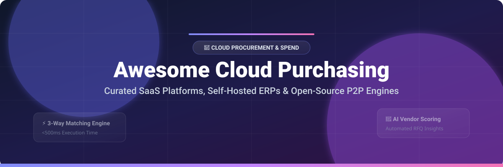

# Awesome-Cloud-Purchasing-Procurement

# Awesome-Cloud-Purchasing-Procurement 🛒 ☁️



  





  
  
  
  
  
  



---

## 🌟 Top Cloud Purchasing & Procurement Ecosystem

**Curated List of Commercial Procurement Platforms & Open-Source Purchasing Tools**  
*Focused on Purchase Requisitions, Purchase Orders, 3-Way Matching, Vendor Management, Approval Workflows & Self-Hosted e-Procurement*

**Last updated: October 2026** 📅

---

### 📌 Overview & SEO Summary
Welcome to the ultimate curated directory of **cloud purchasing and procurement platforms**, **open-source e-procurement systems**, and **spend management frameworks**. Whether you are looking for enterprise-grade commercial solutions (such as *Zip*, *Coupa*, and *Vendr*), or self-hostable open-source alternatives (like *Nexus Procurement*, *VendorBridge AI*, and *Procuman*), this list covers category leaders, 3-way matching engines, and privacy-respecting procurement automation.

**Key Market Context:**
- **Ukraine's Prozorro** open-source e-procurement system saved the state budget **$6 billion** in public funds (2017–2021) and reduced drone purchase prices by **30%** during wartime procurement .
- **Nexus Procurement** provides **framework-agnostic procurement management** with 3-way matching completing in **<500ms for 100 lines** .
- **MyCompany** offers a **free, self-hosted ERP** with purchasing, inventory, and invoicing modules requiring only **4 GB RAM** to start .

---

## 📑 Table of Contents
- [🏢 SaaS & Commercial Platforms](#-saas--commercial-platforms)
- [🔓 Open-Source GitHub Projects](#-open-source-github-projects)
- [🛠️ How to Contribute](#%EF%B8%8F-how-to-contribute)
- [📊 Star History](#-star-history)
- [🤝 Support & Sponsorship](#-support--sponsorship)
- [⚠️ Disclaimer](#%EF%B8%8F-disclaimer)

---

## 🏢 SaaS / Commercial Platforms

The cloud purchasing and procurement market spans **enterprise procurement suites** (Coupa, Zip) that provide end-to-end source-to-pay capabilities, and **specialized SaaS management platforms** (Vendr, Tropic, Vertice) that focus on software purchasing and cost optimization. **AWS Purchasing** provides **consumption-based procurement** through AWS Marketplace and Enterprise Agreements.

| SaaS / Commercial Platform | Company / Owner | Valuation / Market Cap | Standard Edition Starting Price | Free Tier / Free Trial Limits | Description |
| :--- | :--- | :--- | :--- | :--- | :--- |
| **[AWS Purchasing](https://aws.amazon.com/marketplace/)** ☁️ | Amazon | ~$2.0 Trillion | **Consumption-based** for marketplace purchases | **Free tier for AWS services** | **AWS-native procurement** — **AWS Marketplace** for software purchasing with consolidated billing. **Enterprise Agreements** for committed spend discounts. **Private Marketplaces** for organizational controls. |
| **[Zip](https://ziphq.com/)** 🎯 | Zip | Private | **Custom enterprise pricing** | **Demo available** | **Intake-to-procure platform** — **Modern procurement orchestration** with intake forms, approval workflows, and vendor management. **Integrates with ERPs** and SaaS management. |
| **[Vendr](https://www.vendr.com/)** 💰 | Vendr | Private | **Custom pricing** (SaaS purchasing platform) | **Free tier available** | **SaaS buying platform** — **Transparent pricing data** from thousands of SaaS purchases. **Negotiation support** and **contract management**. |
| **[Tropic](https://www.tropicapp.io/)** 📊 | Tropic | Private | **Custom enterprise pricing** | **Demo available** | **Procurement and spend management** — **Intake, approval, and vendor management** with **AI-powered negotiation insights**. |
| **[Vertice](https://www.vertice.one/)** 🔍 | Vertice | Private | **Custom pricing** | **Demo available** | **SaaS and cloud spend optimization** — **Automated procurement** and **renewal management**. |
| **[Coupa](https://www.coupa.com/)** 🏢 | Coupa Software | ~$8 Billion (Thoma Bravo) | **Custom enterprise pricing** | **Demo available** | **Business spend management** — **Source-to-pay, expense management, and treasury** in a unified platform. |
| **[Teampay](https://www.teampay.co/)** 💳 | Teampay | Private | **Custom pricing** | **Demo available** | **Distributed spend management** — **Pre-approval workflows** and **virtual cards** for employee purchasing. |
| **[Procurify](https://www.procurify.com/)** 📋 | Procurify | Private | **Custom pricing** | **Demo available** | **Spend management for mid-market** — **Purchase requests, approvals, and expense tracking**. |
| **[Spendesk](https://www.spendesk.com/)** 💶 | Spendesk | Private | **Custom pricing** | **Free trial available** | **European spend management** — **Corporate cards, expense claims, and invoice management** in one platform. |
| **[Airbase](https://www.airbase.com/)** ✈️ | Airbase (Paylocity) | ~$10 Billion (Paylocity) | **Custom pricing** | **Demo available** | **Spend management platform** — **Bill pay, corporate cards, and expense management** with accounting automation. |

---

## 🔓 Open-Source GitHub Projects

*Sorted by GitHub_Stars_Count (Descending)* 🌟

- **[Nexus Procurement](https://github.com/azaharizaman/nexus-procurement)**   
  **Framework-agnostic procurement management package**, MIT licensed. **Pure PHP 8.3+ with zero framework dependencies** — all business logic in packages, implementation in applications . **Complete procurement lifecycle**: purchase requisitions (draft → approval → PO conversion), purchase orders with budget validation, goods receipt notes, and **3-way matching engine validating Invoice-PO-GRN alignment in <500ms for 100 lines** . **Segregation of Duties enforced**: Requester ≠ Approver ≠ Receiver ≠ Payment Authorizer . **Budget controls**: PO cannot exceed requisition by >10% without re-approval. **19 interfaces, 6 business logic services, 10 domain exceptions**. **Vendor quote management** with RFQ process and quote comparison . **The most architecturally rigorous open-source procurement engine** — contract-driven design for enterprise ERP integration. 🏛️

- **[VendorBridge AI](https://github.com/vatsalgajera-tech/VendorBridge-AI)**   
  **AI-powered procurement ERP**, open-source. **Complete procurement lifecycle**: vendor management with risk scoring, RFQ management, quotation management with **AI-powered comparison engine**, multi-stage approval workflow, purchase orders auto-generated from accepted quotations, invoice management, dashboard with live stats, reports, and activity logs . **AI scoring ranks vendors on price competitiveness, delivery speed, vendor rating, historical performance** and **auto-recommends the best vendor with justification** . **Role-based access**: Admin, Manager, Procurement Officer, Vendor. **Demo credentials available**. **React 18 frontend**. **The most AI-native open-source procurement platform**. 🤖

- **[Procure-to-Pay System](https://github.com/manziosee/procure-to-pay-system)**   
  **Comprehensive P2P system with Django REST API and React TypeScript frontend**, open-source. **Multi-level approval workflow**: Staff creates request → Level 1 Approver → Level 2 Approver → Auto-generate PO → Staff submits receipt → Receipt validation . **Dual approval requirement** — both levels must approve. **Immutable status** once approved/rejected. **AI-powered document processing**: OCR with pytesseract, PDF processing, OpenAI integration for intelligent data extraction . **JWT authentication with RBAC**. **Complete API documentation with Swagger**. **The most workflow-focused open-source P2P system**. 📋

- **[MyCompany](https://github.com/lsfusion-solutions/mycompany)**   
  **Free, open-source, self-hosted ERP and CRM for small businesses**, Apache-2.0 licensed. **Single database for all modules** — no synchronization between parts of the system . **Purchasing & Inventory**: purchase orders, multi-warehouse stock, receipts, shipments, and movement history. **Sales & CRM**, **Invoicing** with payment tracking, **Manufacturing** with BOMs, **Projects**, **HR**, and **Retail POS** . **Runs on 4 GB RAM server**. **Docker and one-line Linux install**. **Translated into English, Polish, and Russian**. **Actively developed since 2019**. **The most complete free ERP for SMBs**. 🏢

- **[Procuman Community Edition](https://github.com/procuman/procuman-community-edition)**   
  **Free e-Procurement software built on EspoCRM**, open-source. **Supplier management** with contact database and categorization. **Product catalog** with supplier associations and pricing tracking. **Purchase order management** with automated calculations and **professional PDF generation**. **Multi-language support** for global deployment . **Requires EspoCRM platform** (PHP 8.3+, MySQL/MariaDB). **Professional Edition adds requisitions with multi-level approvals, supplier portal, contract management, e-tendering, and supplier invoices** . **The most practical open-source e-procurement for organizations already using EspoCRM**. 🛒

- **[BrassLedger](https://github.com/rhamenator/BrassLedger)**   
  **Open-source cross-platform accounting and business management system**, GPL-3.0 licensed. **General ledger, receivables, payables, payroll, operations, reporting, tax workflows, and printable business forms** in one application . **Operations workspaces** for inventory, order flow, purchasing, fulfillment, and operational forms. **Cross-platform .NET application** with installers for Windows, macOS, and Linux. **First-time setup flow** for company creation without editing config files. **The most comprehensive open-source business management platform** — covers accounting and procurement in one system. 💼

- **[Nexus Payable](https://github.com/azaharizaman/nexus-payable)**   
  **Framework-agnostic accounts payable management package**, MIT licensed. **Vendor management** with configurable payment terms and matching tolerances. **Bill processing** via manual entry or CSV import. **3-way matching** engine with **per-vendor tolerance configuration** — configurable quantity and price variance thresholds prevent GL posting when variances exceed limits . **Multi-currency support** with base currency equivalent. **Payment scheduling** with automated due date calculation and early payment discount tracking. **Aging reports** for 30/60/90-day analysis. **The most robust open-source accounts payable engine**. 📊

- **[Vendor Management System](https://github.com/SevenSquare-Tech/vendor-management-system)**   
  **Vendor Management System built with Laravel and Electron JS**, open-source. **Vendor management** with add, update, view, remove, and archive inactive vendors. **Contract management** with start/end dates, payment schedules, and renewal alerts. **Order management** with purchase orders linked to vendors, status tracking (pending, approved, delivered, canceled), and invoice generation . **Reporting** for vendor performance, order summary, and contract renewals. **Desktop-friendly** via Electron wrapper. **The most complete open-source vendor management for desktop deployment**. 🏢

---

## 🛠️ How to Contribute

Contributions are welcome! Follow these steps to submit new procurement platforms or open-source purchasing software:

1. 🍴 **Fork** the repository.
2. 📝 **Add/edit** entries in `README.md` maintaining table/list structure and formatting.
3. 🔗 Include project title, official website/GitHub link, exact Stars_Count, license, and brief description.
4. 🚀 Submit a **Pull Request** with a descriptive summary of your changes.

---

## 📊 Star History



---

## 🤝 Support & Sponsorship

If you find this cloud purchasing and procurement repository useful, please consider supporting the project:

- ⭐ **Star** this repository to increase visibility!
- 🔀 **Fork** and share with fellow procurement professionals, finance teams, and open-source advocates.
- ☕ **Sponsor & Buy Me a Coffee**: Support ongoing open-source curation via the [GitHub Sponsor Dashboard](https://github.com/sponsors/ishandutta2007).

---

## ⚠️ Disclaimer

- This is a **community-curated** list — not exhaustive and not an endorsement. ℹ️
- **Open-source procurement tools are not turnkey** — **Nexus Procurement requires PHP 8.3+ and Composer integration** . **Procuman requires EspoCRM platform installation** . **MyCompany requires 4 GB RAM and Docker or Linux server** . **Always validate procurement workflows with a proof-of-concept** before production deployment.
- **3-way matching is critical for financial controls** — **Nexus Procurement validates Invoice-PO-GRN alignment** with **per-vendor tolerance configuration** . **Segregation of Duties is enforced**: Requester ≠ Approver ≠ Receiver ≠ Payment Authorizer . **These controls prevent fraud and duplicate payments**.
- **Ukraine's Prozorro demonstrates open-source procurement at national scale** — **$6 billion in savings** and **30% drone price reduction** during wartime procurement . **The system is built on Open Contracting Data Standard** for cross-country data comparison.
- **AI-powered procurement is emerging** — **VendorBridge AI auto-recommends vendors with justification** . **Procure-to-Pay System uses OpenAI for document extraction** . **Always validate AI recommendations against procurement policies** before acting. 🛒

---



  <b>Made with ❤️ for procurement professionals, finance teams, and open-source purchasing advocates.</b>

